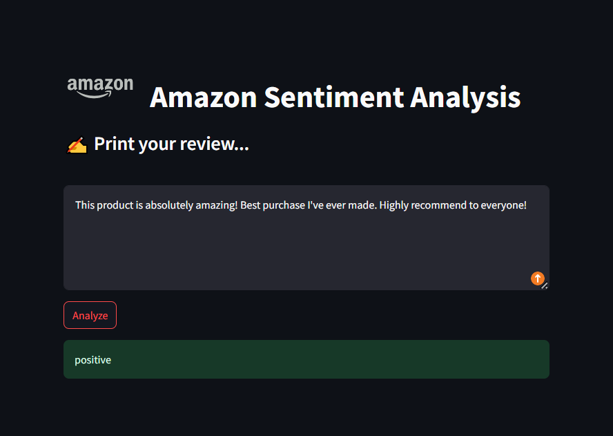
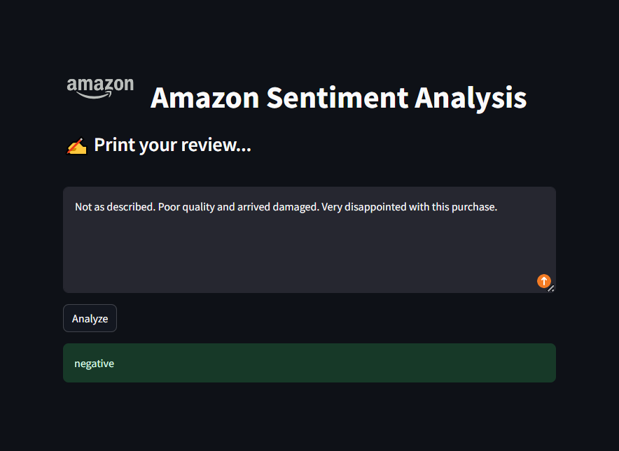
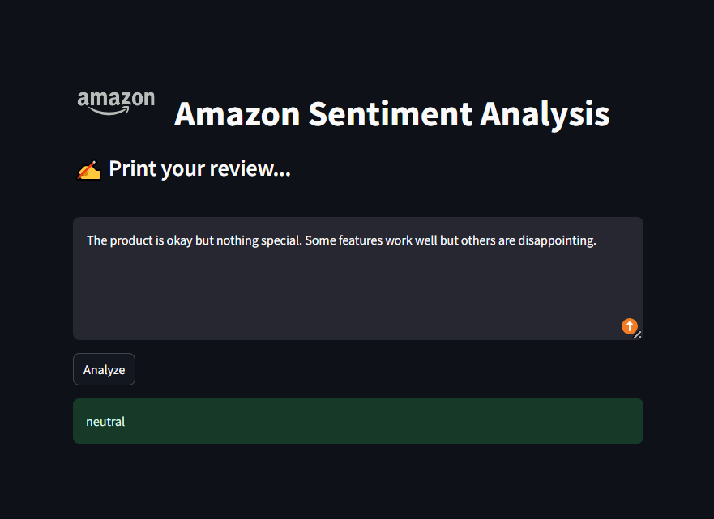

# Amazon Sentiment Analysis: From Rules to Transformers

This project aims to build a complete sentiment analysis system that goes beyond just testing a model in a notebook. I wanted to create a tool that can take a real Amazon review and immediately tell you if the customer was satisfied or not, using a professional software architecture.

## The Benchmark: Finding the Best Model
Before building the app, I conducted a study to compare three different ways of handling natural language to see which one handles the complexity of human language best:

1.  **Rule-Based (SentiWordNet)**: I started with a dictionary-based approach using lexical scoring. It was fast but struggled with context and negation, reaching only **47%** balanced accuracy.
2.  **Machine Learning (TF-IDF + MLP)**: Moving to a machine learning approach with word frequencies (TF-IDF) improved things significantly, jumping to **67%** accuracy.
3.  **Deep Learning (RoBERTa)**: This was the winner. By using a pre-trained Transformer model to capture bidirectional context, the system achieved 75% accuracy and significantly improved its handling of negations and complex sentence structures.


---

## How it's Built (The Tech Stack)
I decided to separate the logic from the interface to make the project modular and clean.

* **The Backend (FastAPI)**: I used **FastAPI** to create a dedicated server that loads the **RoBERTa** model and handles the analysis. It provides a fast endpoint that receives text and returns the predicted sentiment directly (Positive, Negative, or Neutral).
* **The Frontend (Streamlit)**: I built the user interface with **Streamlit** to make it interactive and accessible. It communicates with the FastAPI server behind the scenes to show results in real-time.


### A look at the interface
Here is the final result of the application, featuring a clean dark theme and a simple input for Amazon reviews:

<p align="center">
  
  
  
</p>

## Project Organization
The repository is organized to follow industry standards for Data Science projects:
* **`notebooks/`**: The full research study, benchmarks, and data exploration.
* **`src/app/`**: Holds the production code for the **FastAPI** backend (`main.py`) and **Streamlit** frontend (`streamlit.py`).
* **`src/models/`**: Helper functions for model loading and lexical processing.
* **`saved_models/`**: Storage for the serialized RoBERTa tokenizer and weights.
---

## Getting Started
To run this project locally, you'll need to start both the API and the Web Interface in separate terminals:

1.  **Start the API:**
    ```bash
    uvicorn src.app.main:app --reload
    ```
2.  **Start the UI:**
    ```bash
    streamlit run src.app.streamlit.py
    ```